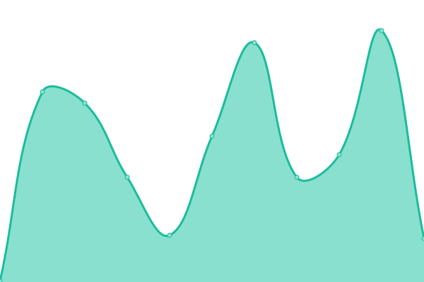

# [📈 Live Status](https://status.wi.in.th): <!--live status--> **🟩 All systems operational**

This repository contains the open-source uptime monitor and status page for [Wiput Pootong](https://cv.wiput.me), powered by [Upptime](https://github.com/upptime/upptime).

With [Upptime](https://upptime.js.org), you can get your own unlimited and free uptime monitor and status page, powered entirely by a GitHub repository. We use [Issues](https://github.com/wiput1999/uptime/issues) as incident reports, [Actions](https://github.com/wiput1999/uptime/actions) as uptime monitors, and [Pages](https://status.wi.in.th) for the status page.

<!--start: status pages-->
<!-- This summary is generated by Upptime (https://github.com/upptime/upptime) -->
<!-- Do not edit this manually, your changes will be overwritten -->
<!-- prettier-ignore -->
| URL | Status | History | Response Time | Uptime |
| --- | ------ | ------- | ------------- | ------ |
| [wiput.me](https://wiput.me) | 🟩 Up | [wiput-me.yml](https://github.com/wiput1999/uptime/commits/master/history/wiput-me.yml) | 

 161ms
     
 | 

   

| [space.wiput.me](https://space.wiput.me) | 🟩 Up | [space-wiput-me.yml](https://github.com/wiput1999/uptime/commits/master/history/space-wiput-me.yml) | 

 268ms
     
 | 

   

| [wi.in.th](https://wi.in.th) | 🟩 Up | [wi-in-th.yml](https://github.com/wiput1999/uptime/commits/master/history/wi-in-th.yml) | 

 367ms
     
 | 

   

| [wi.thai](https://ไว.ไทย) | 🟩 Up | [wi-thai.yml](https://github.com/wiput1999/uptime/commits/master/history/wi-thai.yml) | 

 204ms
     
 | 

   

<!--end: status pages-->

[**Visit our status website →**](https://status.wi.in.th)

## 📄 License

- Code: [MIT](./LICENSE) © [Wiput Pootong](https://cv.wiput.me)
- Data in the `./history` directory: [Open Database License](https://opendatacommons.org/licenses/odbl/1-0/)
